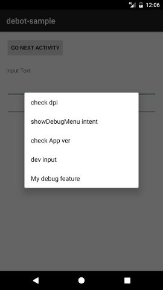

[ ](https://bintray.com/tomoima525/maven/debot/_latestVersion)
[](https://android-arsenal.com/details/1/2562)
[](https://circleci.com/gh/tomoima525/debot)
# Debot
  
A simple Android library to create Debugging menu.

Debot offers features that are useful to debug Android applications. Those features can be added to any activity that has the toolbar menu. Also, developers can easily add their own custom debugging features with simple steps.


## How it looks
Once you setup Debot to your app, you will see couple of debugging features are added to your toolbar menu.

* Default debugging menu  

* Check Density  

* Check App ver  

* Show intent and Activity Info  

* Dev input (Automatically adds text to EditText field )  


## Setup
### Download
Grab Debot from Gradle:

```groovy
debugCompile 'com.tomoima.debot:debot:{latest_version}'
releaseCompile 'com.tomoima.debot:debot-no-op:{latest_version}'
```

{latest_version} is now :[ ](https://bintray.com/tomoima525/maven/debot/_latestVersion)


### Initialization
1. Call `DebotConfigurator.configureWithDefault()` at the Application's `onCreate()` class.

```java
public class MyApplication extends Application {
    @Override
    public void onCreate() {
        super.onCreate();
        DebotConfigurator.configureWithDefault(this);
    }
}
```

2. Set below to any Activity you want to show the debugging menu.

```java
public class MainActivity extends AppCompatActivity{
    @Override
    protected void onCreate(Bundle savedInstanceState) {
        super.onCreate(savedInstanceState);
        setContentView(R.layout.activity_main);
        Debot.getInstance(this);
    }
}    
```

That's it! Start your app and there will be the debugging menu added on the toolbar. 

## Change Debot visibility

In some cases, You don't want to show debugging menu. You can control the visibility of Debugging menu by just calling `Debot.setVisibility()` at `onPrepareOptionsMenu`  

```java
@Override
public boolean onPrepareOptionsMenu(Menu menu) {
    Debot.setVisibility(menu, menuVisibility);
    return super.onPrepareOptionsMenu(menu);
}
```


See the [`debot-sample` project](debot-sample) for more details.

## Custom debugging plugins
You can create your own debugging feature by developing a class which inherits `DebotStrategy`.


```java
public class MyDebotStrategy extends DebotStrategy{
    @Override
    public void startAction(@NonNull Activity activity) {
    // Do your things
    }
}
```

Then, at the Application class, call `Debot.configureWithCustomizeMenu()`


```java
public class MyApplication extends Application {
    @Override
    public void onCreate() {
        super.onCreate();
        DebotStrategyBuilder builder = new DebotStrategyBuilder.Builder(context)
                .registerMenu("My debug feature", new MyDebotStrategy())
                .build();
        DebotConfigurator.configureWithCustomizeMenu(this, builder.getStrategyList());
    }
}
```

## Call a specific method from your Activity
If you want to call a specific method from your Activity, annotate the method with `@DebotAnnotation`

```java
//Your Activity
@DebotAnnotation("debugInput")  // A parameter for @DebotAnnotation should be same as the method's name
public void debugInput() {
    // Do things
}

```

Also, setup a custom debugging plugin with `DebotCallActivityMethodStrategy`

```java
public class MyApplication extends Application {
    @Override
    public void onCreate() {
        super.onCreate();
        DebotStrategyBuilder builder = new DebotStrategyBuilder.Builder(context)
                .registerMenu("input", new DebotCallActivityMethodStrategy("debugInput"))
                .build();
        DebotConfigurator.configureWithCustomizeMenu(this, builder.getStrategyList());
    }
}

```

## License

```
Tomoaki Imai 2016
Licensed under the Apache License, Version 2.0 (the "License").
You may obtain a copy of the License at

http://www.apache.org/licenses/LICENSE-2.0

Unless required by applicable law or agreed to in writing, software distributed
under the License is distributed on an "AS IS" BASIS, WITHOUT WARRANTIES
OR CONDITIONS OF ANY KIND, either express or implied. See the License for
the specific language governing permissions and limitations under the License.

You agree that all contributions to this repository, in the form of fixes, 
pull-requests, new examples etc. follow the above-mentioned license.
```